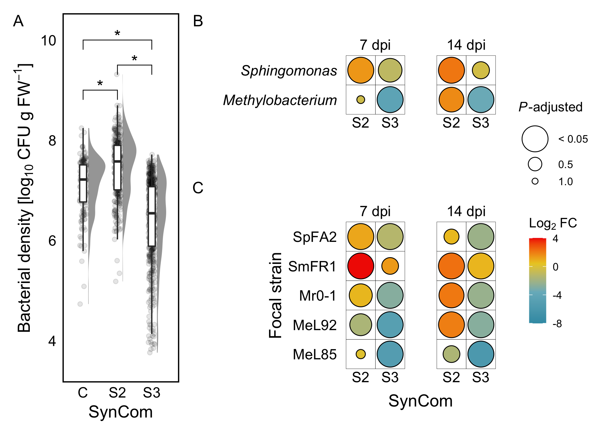
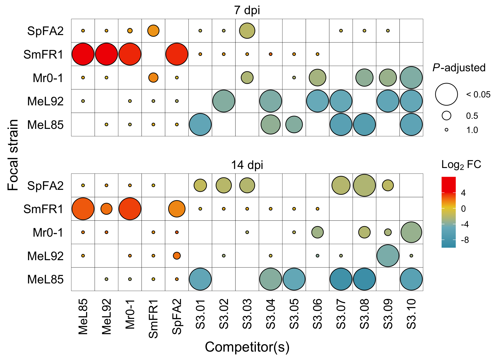

## Taxon-specific population density changes correlate with community complexity


```r
data_cfu %>% head
```

<div data-pagedtable="false">
  <script data-pagedtable-source type="application/json">
{"columns":[{"label":[""],"name":["_rn_"],"type":[""],"align":["left"]},{"label":["exp"],"name":[1],"type":["chr"],"align":["left"]},{"label":["sample"],"name":[2],"type":["int"],"align":["right"]},{"label":["dpi"],"name":[3],"type":["fct"],"align":["left"]},{"label":["synID"],"name":[4],"type":["fct"],"align":["left"]},{"label":["comID"],"name":[5],"type":["chr"],"align":["left"]},{"label":["syncom"],"name":[6],"type":["chr"],"align":["left"]},{"label":["strain"],"name":[7],"type":["chr"],"align":["left"]},{"label":["taxa"],"name":[8],"type":["fct"],"align":["left"]},{"label":["channel"],"name":[9],"type":["chr"],"align":["left"]},{"label":["cfu"],"name":[10],"type":["dbl"],"align":["right"]},{"label":["cfu_log"],"name":[11],"type":["dbl"],"align":["right"]}],"data":[{"1":"e1","2":"1","3":"07dpi","4":"C","5":"Com01","6":"C.01","7":"meL85","8":"Methylobacterium","9":"C0","10":"8800000","11":"6.9","_rn_":"1"},{"1":"e1","2":"2","3":"07dpi","4":"C","5":"Com01","6":"C.01","7":"meL85","8":"Methylobacterium","9":"C0","10":"15400000","11":"7.2","_rn_":"2"},{"1":"e1","2":"3","3":"07dpi","4":"C","5":"Com01","6":"C.01","7":"meL85","8":"Methylobacterium","9":"C0","10":"19900000","11":"7.3","_rn_":"3"},{"1":"e1","2":"4","3":"07dpi","4":"C","5":"Com01","6":"C.01","7":"meL85","8":"Methylobacterium","9":"C0","10":"9040000","11":"7.0","_rn_":"4"},{"1":"e2","2":"1","3":"07dpi","4":"C","5":"Com01","6":"C.01","7":"meL85","8":"Methylobacterium","9":"C0","10":"769000","11":"5.9","_rn_":"5"},{"1":"e2","2":"2","3":"07dpi","4":"C","5":"Com01","6":"C.01","7":"meL85","8":"Methylobacterium","9":"C0","10":"2660000","11":"6.4","_rn_":"6"}],"options":{"columns":{"min":{},"max":[10]},"rows":{"min":[10],"max":[10]},"pages":{}}}
  </script>
</div>


```r
linear_cfu = lm(cfu_log ~ synID + dpi + taxa, data_cfu)

# Shapiro-Wilk test for normality
cfu_normality = shapiro.test(rstandard(linear_cfu))

# Breusch-Pagan test for homogeneity of variances
cfu_homoskedasticity = ncvTest(linear_cfu)
```


We first investigated the effect of community complexity on bacterial population densities from two bacterial taxa (*Methylobacterium* and *Sphingomonas*) *in planta* using a full factorial design (Fig. 1). Bacterial densities were determined for each strain at different community complexities (C = near isogenic control; S2 = two-species SynCom; S3 = three-species SynCom) after 7 and 14 days post-inoculation (dpi).

We used non-parametric methods to analyse the CFU data, considering violation of normality (Shapiro-Wilk test, *W* = 0.94, *p* = 3.67\times 10^{-19}) and homogeneity of variance (Breusch-Pagan test, $\ X^{2}$ = 31.1, *p* = 2.45\times 10^{-8})


```r
# Kruskal-Wallis test and effect size for community complexity (synID)
kw_synID = kruskal.test(cfu_log ~ synID, data_cfu) %>% tidy %>% 
    mutate(p_label = case_when(p.value < 0.05 ~ "< 0.05", TRUE ~ as.character(p.value)))
keff_synID = kruskal_effsize(formula = cfu_log ~ synID, data = data_cfu, ci=TRUE, nboot=100)

# Dunn's Test
dunn_synID = dunn_test(cfu_log ~ synID, p.adjust.method = "holm", data=data_cfu) %>% tibble %>% 
    mutate(p_label = case_when(p.adj < 0.05 ~ "< 0.05", TRUE ~ as.character(p.adj)))

# Fold change of population density by SynCom complexity (synID)
fc_cfu_synID = data_cfu %>% 
    group_by(synID) %>% 
    summarise(median_cfu = median(cfu)) %>% 
    mutate(FC = median_cfu/median_cfu[1],
           logFC = log2(FC))
```

We tested how the community complexity influenced changes in individual bacterial populations. Community complexity had a large effect on bacterial populations (Kruskal-Wallis, *H*(2) = 307.02, *p* = < 0.05, $\eta^{2}$(2) = 0.34 [0.29-0.38]). This was reflected as a significant 2.29-fold increase in population densities composed of two-species communities (*W* = 4.48, *p* < 0.05), and a pronounced 4.71-fold decrease in S3 (*W* = 8.62, *p* < 0.05), both compared to the near-isogenic control, C (Figure \@ref(fig:figure_main_3)).


```r
# Wilcoxon test and effect size for sampling time (dpi)
w_dpi = wilcox.test(formula = cfu_log ~ dpi, data = data_cfu) %>% tidy %>% 
    mutate(p_label = case_when(p.value < 0.05 ~ "< 0.05", TRUE ~ as.character(p.value)))
weff_dpi = wilcox_effsize(formula = cfu_log ~ dpi, data = data_cfu, ci=TRUE, nboot=100)

# Fold change of population density by time of sampling (dpi)
fc_cfu_dpi = data_cfu %>% 
    group_by(dpi) %>% 
    summarise(median_cfu = median(cfu)) %>% 
    mutate(FC = median_cfu/median_cfu[1],
           logFC = log2(FC))
```

Changes in population density could be related to temporal changes. Thus, we evaluated how population density changed over the two times of sampling, namely 7 dpi and 14 dpi. Here we observed a small yet significant effect of time of sampling (Wilcoxon, *W* = 84973, *p* = < 0.05, Wilcoxon's *r* = 0.15 [0.09-0.22]), representing an increase in 1.69-fold between 7 and 14 dpi.


```r
# Wilcoxon test and effect size for bacterial group (taxa)
w_taxa = wilcox.test(formula = cfu_log ~ taxa, data = data_cfu) %>% tidy %>% 
    mutate(p_label = case_when(p.value < 0.05 ~ "< 0.05", TRUE ~ as.character(p.value)))
weff_taxa = wilcox_effsize(formula = cfu_log ~ taxa, data = data_cfu, ci=TRUE, nboot=100)

# Fold change of population density by bacterial group (taxa)
fc_cfu_taxa = data_cfu %>% 
    group_by(taxa) %>% 
    summarise(median_cfu = median(cfu)) %>% 
    mutate(FC = median_cfu/median_cfu[1],
           logFC = log2(FC))
```


We wanted to test whether the observed change in population density was associated to specific bacterial taxa. Consequently, we observed a difference between populations that belonged to *Methylobacterium* and *Sphingomonas* (Wilcoxon, *Z* = 49825.5, *p* = < 0.05, Wilcoxon's *r* = 0.42 [0.36-0.49]). The population densities of *Sphingomonas* were 5.11 times larger than that of *Methylobacterium*. 

Within *Sphingomonas*, SmFR1 consistently increased population sizes in S2, regardless of the presence of a second species, and to a lesser extent in S3 (Fig. Sup). For SpFA2, while population sizes increased transiently in S2, they generally decreased in S3.

By contrast, *Methylobacterium* species responded negatively to community complexity. In general, MeL85, MeL92, and Mr0-1 consistently decreased in population sizes, especially in S3 and less pronounced in S2. Within *Methylobacterium*, MeL92 and Mr0-1 benefited from the presence of any other species (S2). However, this effect was only observed at 14 dpi and it was lost when a third competitor was present (S3). MeL85 was the most susceptible species to decreasing in population size over time, and across different community complexities and compositions (Fig. Sup).

These results indicated that bacterial taxa differentially responded to community complexity in the phyllosphere and that *Methylobacterium* are more affected compared to *Sphingomonas*. The most competitive species was the sphingomonad SmFR1, while the most susceptible was the methylobacterium MeL85.


```r
areas <- c(patchwork::area(1,1,3), patchwork::area(1,2,1), patchwork::area(2,2,3))
wrap_elements(full = plt3.a) + plt3.b + plt3.c  + plot_annotation(tag_levels = "A") + plot_layout(design = areas, guides = "collect") & theme(legend.box.just = "center")
```

<div class="figure" style="text-align: center">

<p class="caption">Bacterial population density in the arabidopsis phyllosphere</p>
</div>


```r
plt.sup1
```




