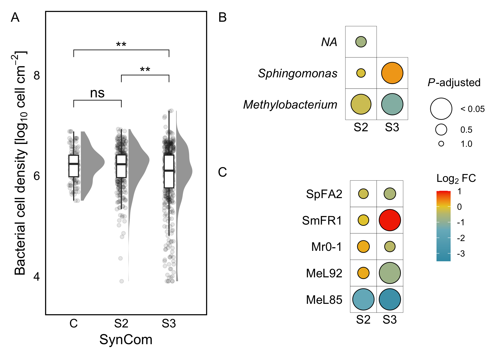

## Spatial distribution of individual strains depend on their community context

We obtained a satisfactory representation of all populations at the single cell resolution and their distributions using the centre of mass of single cells in every bacterial combination (Fig. 2a, Fig. 4). 
The centres of mass of the different cell populations were then used to generate spatial point patterns and further used to analyse spatial distribution patterns of bacteria. In total, we analysed 10,261 fields of view, corresponding to 25 communities (5× C, 10× S2, 10× S3), two sampling points, 3-4 biological replicates (individual plants), and 55±30 (mean±SD) fields of view per replicate, in two independent experiments (Table SX). 


```r
cdf <- readRDS(here('results', 'cdf_fit1.rds'))
quadrat_test <- readRDS(here('results', 'quadrat_test_fit1.rds'))
```

We identified several archetypal patterns that follow the leaf surface topography such as veins and epidermal cell grooves with varying levels of occupancy. We observed that the cell distribution on the leaf surface was heterogenous by subsampling the data set to 500 random fields of view. We confirmed that these patterns can be described by an non-homogeneous Poisson process using a spatial Kolmogorov-Smirnov test (*D* = 0.04, *p* = 0), and a goodness-of-fit with Monte Carlo test ($X^{2}$ = 1.57\times 10^{5}, *p* = 0, n = 999)


Next, we estimated cell density per cm^2^ for each biological replicate and compared our estimations of cell density from single-cell microscopy data (# cell cm^-2^) with colony count data (CFU gFW^-1^). We observed a positive correlation (Pearson's *r* = 0.37, *t* = 11.55, *p* = 9.19\times 10^{-29}).


```r
# Linear model to test normality and homogeneity of variance
linear_cell <-  lm(logCell ~ synID + dpi + taxa, data_cell)

# Shapiro-Wilk test for normality
shapiro.test(rstandard(linear_cell))
```

```
## 
## 	Shapiro-Wilk normality test
## 
## data:  rstandard(linear_cell)
## W = 0.9, p-value <2e-16
```

```r
# Breusch-Pagan test for homogeneity of variances
ncvTest(linear_cell)
```

```
## Non-constant Variance Score Test 
## Variance formula: ~ fitted.values 
## Chisquare = 102, Df = 1, p = <2e-16
```


```r
# Kruskal-Wallis test and effect size for community complexity (synID) grouped by taxa
kw_synID <- data_cell %>%
    group_by(taxa) %>% 
    kruskal_test(logCell ~ synID) %>% 
    mutate(p_label = case_when(p < 0.05 ~ "< 0.05", TRUE ~ as.character(p)))
keff_synID <- data_cell %>% 
    group_by(taxa) %>% 
    kruskal_effsize(logCell ~ synID, ci=TRUE, nboot=100)

## Variables
explanatory = "synID"
group = "taxa"
strain = "strain"

# Fold change of population density by taxa and synID
dunntest_taxa <- dun_func1(data_cell, "logCell", group, explanatory) %>% rename(synID = group2)
fold_taxa <- fold_func1(data_cell, "cell_density", group, explanatory)

# Fold change of population density by strain and synID
dunntest_strain <- dun_func1(data_cell, "logCell", strain, explanatory) %>% rename(synID = group2)
fold_strain <- fold_func1(data_cell, "cell_density", strain, explanatory)
```


```r
# Wilcoxon test and effect size for sampling time (dpi)
w_dpi = data_cell %>% 
    wilcox_test(formula = logCell ~ dpi)

# Fold change of population density by time of sampling (dpi)
fc_cell_dpi = data_cell %>% 
    group_by(dpi) %>% 
    summarise(median_cell = median(cell_density)) %>% 
    mutate(FC = median_cell/median_cell[1],
           logFC = log2(FC))
```

We observed a decrease in cell density between populations from S2 to S3 (Fig. 5a). Differences in cell density were not related to time of sampling (Wilcoxon, *W* = 87352, *p* = 0.56), but rather with a decrease of the *Methylobacterium* populations (log~2~FC = -1.08) and a marginal increase of *Sphingomonas* populations in S3 (log~2~FC = 0.34). These differences were driven by a decrease in MeL85 populations and an increase in SmFR1 in S3 (Fig). These observations indicate that the effect of the community complexity in a population was consistent at the CFU level and the single-cell resolution.


```r
areas <- c(patchwork::area(1,1,3), patchwork::area(1,2,1), patchwork::area(2,2,3))
wrap_elements(full = plt3.a) + plt3.b + plt3.c  + 
    plot_annotation(tag_levels = "A") + 
    plot_layout(guides = "collect", design = areas) & theme(legend.box.just = "center")
```

<div class="figure" style="text-align: center">

<p class="caption">Bacterial cell density in the arabidopsis phyllosphere</p>
</div>
