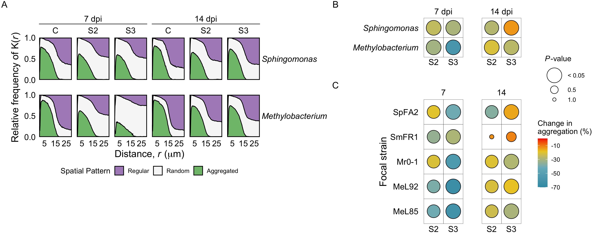
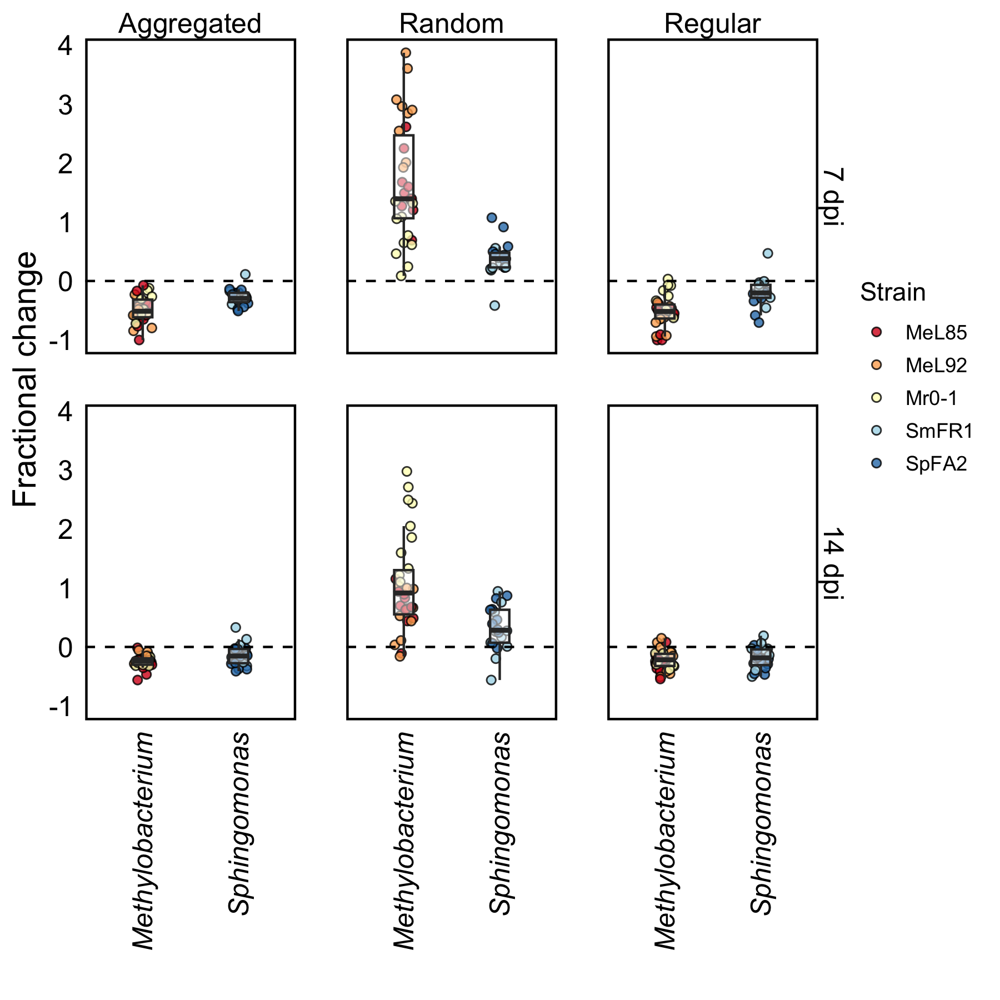
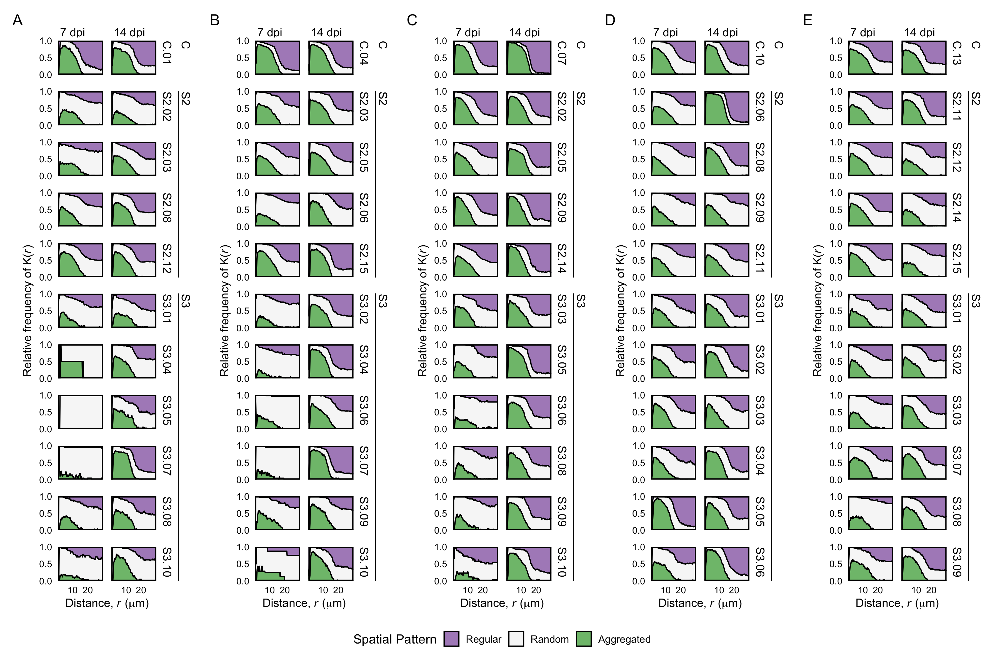

```r
fractional_change_median = function(df, var="fractional_change", group=NULL){
    summary <- df %>% 
        group_by(!!!syms(group)) %>% 
        summarise(median = median(!!!syms(var)),
                  q1 = format(round(quantile(!!!syms(var), 0.25), 2), nsmall = 2),
                  q3 = format(round(quantile(!!!syms(var), 0.75), 2), nsmall = 2),
                  IQR = paste0(q1,"-(",q3,")", sep=''),
                  percentage = abs(100*median),
                  .groups = "drop")
    
    return(summary)
}
```


## Effect of community complexity on intraspecific spatial relations


```r
fractions %>% head
```

<div data-pagedtable="false">
  <script data-pagedtable-source type="application/json">
{"columns":[{"label":["syncom"],"name":[1],"type":["chr"],"align":["left"]},{"label":["synID"],"name":[2],"type":["chr"],"align":["left"]},{"label":["strain"],"name":[3],"type":["chr"],"align":["left"]},{"label":["dpi"],"name":[4],"type":["chr"],"align":["left"]},{"label":["r"],"name":[5],"type":["dbl"],"align":["right"]},{"label":["type"],"name":[6],"type":["chr"],"align":["left"]},{"label":["fraction"],"name":[7],"type":["dbl"],"align":["right"]},{"label":["taxa"],"name":[8],"type":["chr"],"align":["left"]}],"data":[{"1":"C.01","2":"C","3":"meL85","4":"07dpi","5":"0.0","6":"aggregate_fraction","7":"0.000","8":"Methylobacterium"},{"1":"C.01","2":"C","3":"meL85","4":"07dpi","5":"0.0","6":"regular_fraction","7":"0.000","8":"Methylobacterium"},{"1":"C.01","2":"C","3":"meL85","4":"07dpi","5":"0.0","6":"random_fraction","7":"0.000","8":"Methylobacterium"},{"1":"C.01","2":"C","3":"meL85","4":"07dpi","5":"0.2","6":"aggregate_fraction","7":"0.018","8":"Methylobacterium"},{"1":"C.01","2":"C","3":"meL85","4":"07dpi","5":"0.2","6":"regular_fraction","7":"0.357","8":"Methylobacterium"},{"1":"C.01","2":"C","3":"meL85","4":"07dpi","5":"0.2","6":"random_fraction","7":"0.625","8":"Methylobacterium"}],"options":{"columns":{"min":{},"max":[10]},"rows":{"min":[10],"max":[10]},"pages":{}}}
  </script>
</div>
Community context was expected to influence the spatial distribution patterns (aggregation, randomness, regularity) within bacterial populations in the phyllosphere. To evaluate this, we first determined relative frequencies of a spatial pattern based on K(r) for every strain in each community context. We then determined the area under the curve of each spatial pattern and calculated the fractional change compared to the near-isogenic control condition, C (Fig 6a).


```r
## Summary
summary_type <- fractional_change_median(auc_fold_change, group = "type")

## Kruskal-Wallis
kw_type <- auc_fold_change %>% 
    kruskal_test(fractional_change ~ type) %>% 
    mutate(
        p_size = case_when(p < 0.05 ~ 0.05, TRUE ~ p),
        p_label = case_when(p < 0.05 ~ "< 0.05", TRUE ~ as.character(p)))

kw_eff_type <- auc_fold_change %>% 
    kruskal_effsize(fractional_change ~ type, ci=TRUE, nboot=100)

## One-sample Wilcoxon test
w1_type <-  auc_fold_change %>% 
    group_by(type) %>% 
    wilcox_test(fractional_change ~ 1, mu = 0, detailed = TRUE) %>% 
    select(type, estimate, statistic, p) %>% 
    mutate(
        p_size = case_when(p < 0.05 ~ 0.05, TRUE ~ p),
        p_label = case_when(p < 0.05 ~ "< 0.05", TRUE ~ as.character(p)))
```

Our initial analysis showed that spatial distribution patterns within populations differed from their respective controls and were also different between them (Kruskal-Wallis, *H*(2) = 177.1, *p* < 0.05). Generally, populations decreased in 27.54% and 26.14% in aggregation and regularity, respectively, and consequently, random distributions increased in 67.09% (Fig. SX).


```r
## Summary
summary_dpi <- fractional_change_median(auc_fold_change, group="dpi")

## One sample Wilcoxon test
w1_dpi = auc_fold_change %>% 
    group_by(dpi, type) %>% 
    wilcox_test(fractional_change ~ 1, mu = 0, detailed = TRUE) %>% 
    select(dpi, type, estimate, statistic, p) %>% 
    mutate(
        p_size = case_when(p < 0.05 ~ 0.05, TRUE ~ p),
        p_label = case_when(p < 0.05 ~ "< 0.05", TRUE ~ as.character(p)))

## Two samples Wilcoxon test
w2_dpi <- auc_fold_change %>% 
    group_by(type) %>% 
    wilcox_test(fractional_change ~ dpi, p.adjust.method = "holm", detailed = TRUE)
```

The observed distribution patterns were consistent between time points: aggregation and regularity within populations decreased, while randomness increased from 7 to 14 dpi. Considering that aggregation and regularity were not statistically different as they follow a consistent pattern, and randomness is a factor that would be related to neutral rather than deterministic processes, we continued our analysis focusing on the changes in aggregation pattern within populations and its influencing factors.


```r
## Summary
summary_taxa <- fractional_change_median(auc_aggregation, group=c("taxa", "dpi"))
summary_strain <-  fractional_change_median(auc_aggregation, group = c("strain", "dpi")) %>% 
    filter(dpi == "07dpi")

## Two samples Wilcoxon test for taxa (Methylobacterium vs Sphingomonas)
w2_taxa <- auc_aggregation %>% 
    group_by(dpi) %>% 
    wilcox_test(fractional_change ~ taxa, p.adjust.method = "holm", detailed = TRUE)

## One sample Wilcoxon test for taxa (Methylobacterium vs Sphingomonas)
w1_taxa <-  auc_aggregation %>% 
    group_by(synID, dpi, taxa) %>% 
    wilcox_test(fractional_change ~ 1, mu = 0, detailed = TRUE) %>% 
    select(synID, dpi, taxa, estimate, statistic, p) %>% 
    mutate(
        p_size = case_when(p < 0.05 ~ 0.05, TRUE ~ p),
        p_label = case_when(p < 0.05 ~ "< 0.05", TRUE ~ as.character(p)))

w1_taxa_plot_data <- fractional_change_median(auc_aggregation, group = c("synID", "dpi", "taxa")) %>% 
    left_join(., w1_taxa, by = c("synID", "dpi", "taxa"))

## One sample Wilcoxon test for strains
w1_strain  <-  auc_aggregation %>% 
    group_by(synID, dpi, strain) %>% 
    wilcox_test(fractional_change ~ 1, mu = 0, detailed = TRUE) %>% 
    select(synID, dpi, strain, estimate, statistic, p) %>% 
    mutate(
        p_size = case_when(p < 0.05 ~ 0.05, TRUE ~ p),
        p_label = case_when(p < 0.05 ~ "< 0.05", TRUE ~ as.character(p)))

w1_strain_plot_data <- fractional_change_median(auc_aggregation, group = c("synID", "dpi", "strain")) %>% 
    left_join(., w1_strain, by = c("synID", "dpi", "strain"))
```

Comparing the aggregation pattern between taxa, we observed that *Methylobacterium* and *Sphingomonas* differ in the magnitude of their change in aggregation, but only at 7 dpi (Wilcoxon, *W* = 133, *p* = 0). While both taxa decreased their self-aggregation pattern (Figure X), *Methylobacterium* showed the largest decrease in aggregation (51.24%), being MeL85 and MeL92 among the most affected (50.69 and 58.41%, respectively). By contrast, the sphingomonads SmFR1 and SpFA2 were the least affected, with a 29.99 and 24.45% decrease in self-aggregation, respectively.


```r
##  Summary
summary_synID <- auc_aggregation %>% 
    group_by(dpi, synID) %>% 
    summarise(median = median(fractional_change),
              q1 = format(round(quantile(fractional_change, 0.25), 2), nsmall = 2),
              q3 = format(round(quantile(fractional_change, 0.75), 2), nsmall = 2),
              IQR = paste0(q1,"-(",q3,")", sep=''),
              percentage = abs(100*median),
              .groups = "drop")

summary_synID_strain <- auc_aggregation %>% 
    filter(dpi == "07dpi") %>% 
    group_by(synID, strain) %>% 
    summarise(median = median(fractional_change),
              q1 = format(round(quantile(fractional_change, 0.25), 2), nsmall = 2),
              q3 = format(round(quantile(fractional_change, 0.75), 2), nsmall = 2),
              IQR = paste0(q1,"-(",q3,")", sep=''),
              percentage = abs(100*median),
              .groups = "drop")

## Two samples Wilcoxon test for SynCom ID (S2 vs S3)
w2_synID <- auc_aggregation %>% 
    group_by(dpi) %>% 
    wilcox_test(fractional_change ~ synID, p.adjust.method = "holm")

##  Dunn test for aggregation patterns of each strain at 7 dpi
d_synID_strain <- auc_aggregation %>% 
    filter(dpi == "07dpi") %>% 
    group_by(synID) %>% 
    dunn_test(fractional_change ~ strain, p.adjust.method = "holm") %>% 
    filter(p.adj < 0.05)
```

Lastly, we evaluated the effect of community complexity in the changes in aggregation pattern of each population. We observed that populations belonging to S2 had a different aggregation pattern to those in S3. Consistent with our previous observation, this difference was statistically significant only at 7 dpi (Wilcoxon, *W* = 452, *p* = 0). Consequently, we focused our analysis at this particular sampling time, which showed that differences in aggregation patterns were more pronounced in S3 than in S2. This was reflected in a 49.48% decrease in self-aggregation in bacterial populations in S3, and only a 27.01% decrease in S2. Particularly, MeL85 and MeL92 decreased in 61.48% and 65.11%, respectively, and SmFR1 only with a 29.36% decrease (Figure). Consequently, MeL82 and MeL92 were statistically different to SmFR1 at S3.

The results of our analysis indicated that bacterial taxa differentially change their spatial distribution patterns in response to community complexity. These changes represented a decrease in self-aggregation and self-regularity, and an increase in their random distribution, particularly for *Methylobacterium* at 7 dpi. Consistent with our results at the CFU-level, *Methylobacterium* were more susceptible than *Sphingomonas*, especially for MeL85 and MeL92 being the most affected, and SmFR1 the most resilient. 


## Plots


```r
areas <- c(patchwork::area(1,1,3,3), patchwork::area(1,4,1), patchwork::area(2,4,4))
wrap_elements(plot = plt.frq) + plt.taxa + plt.strain  + 
    plot_annotation(tag_levels = "A") + 
    plot_layout(guides = "collect", design = areas) & 
    theme(legend.box.just = "center",
          plot.margin = margin(0,1,0,1))
```

```
## Warning: Removed 36 rows containing non-finite values (`stat_align()`).
```

<div class="figure" style="text-align: center">

<p class="caption">Bacterial population density in the arabidopsis phyllosphere</p>
</div>


```r
plt.pattern <- auc_fold_change %>% 
    ggplot(aes(taxa, fractional_change))+
    facet_grid(dpi ~ type, labeller = labeller(dpi = dpi.lab2, type = pattern.lab))+
    geom_jitter(aes(fill = strain), color = "black", stroke = 0.5, width = 0.1, alpha = 0.8, pch = 21)+
    geom_boxplot(alpha = 0.5, fill = "white", width = 0.2, outlier.alpha = 0)+
    geom_hline(yintercept = 0, linetype = "dashed")+
    theme_rs()+
    theme(axis.text.x = element_text(angle = 90, vjust = 0.5, hjust = 1, face="italic"),
          strip.text = element_text(face = "plain"))+
    labs(x = "", y = "Fractional change")+
    scale_fill_manual(name = "Strain", values=sp.pal, labels=sp.lab)

plt.pattern
```

<div class="figure" style="text-align: center">

<p class="caption">Spatial patterns</p>
</div>


```r
frq.plt.meL85 + frq.plt.meL92 + frq.plt.mr01 + frq.plt.smfr1 + frq.plt.spfa2 + 
    plot_annotation(tag_levels = "A")+
    plot_layout(ncol = 5, guides = "collect") & 
    theme(legend.position = "bottom",
          axis.text = element_text(size = 8),
          axis.title = element_text(size = 10),
          strip.text = element_text(size = 10))
```

<div class="figure" style="text-align: center">

<p class="caption">Frequency plots K</p>
</div>

