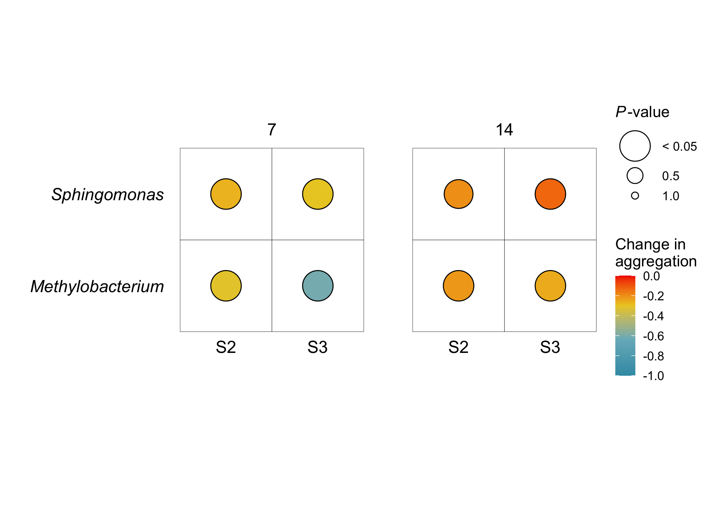
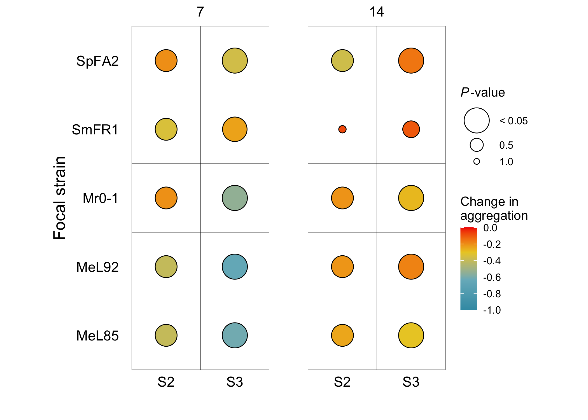
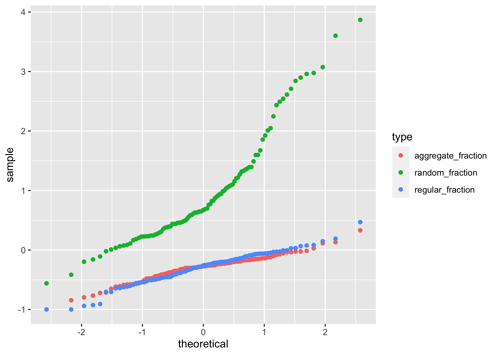
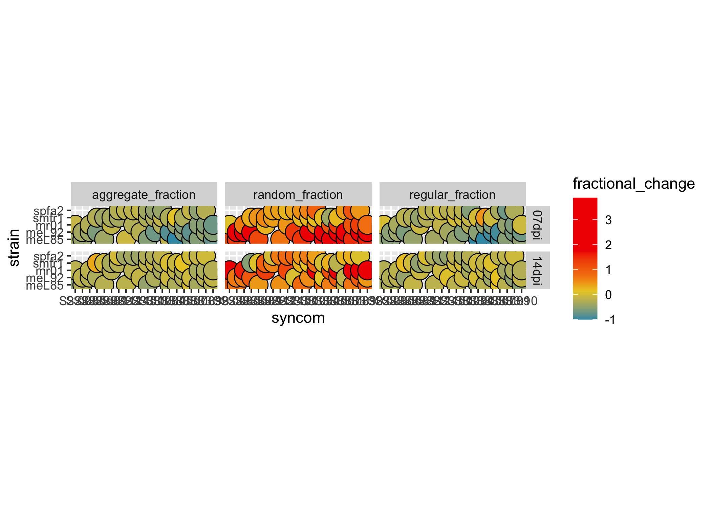
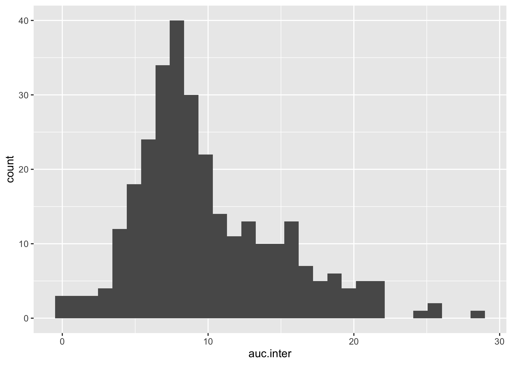
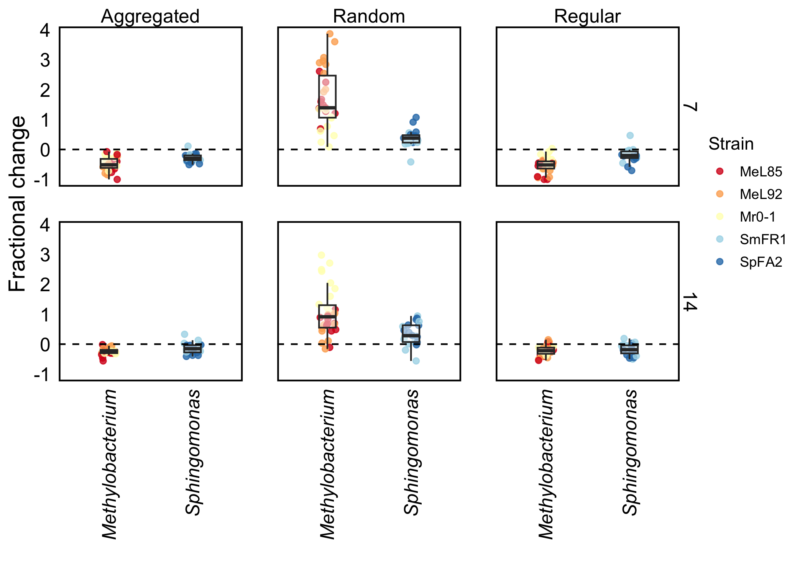

## Effect of community complexity on intraspecific spatial relations


```r
fractions %>% head
```

<div data-pagedtable="false">
  <script data-pagedtable-source type="application/json">
{"columns":[{"label":["syncom"],"name":[1],"type":["chr"],"align":["left"]},{"label":["synID"],"name":[2],"type":["chr"],"align":["left"]},{"label":["strain"],"name":[3],"type":["chr"],"align":["left"]},{"label":["dpi"],"name":[4],"type":["chr"],"align":["left"]},{"label":["r"],"name":[5],"type":["dbl"],"align":["right"]},{"label":["type"],"name":[6],"type":["chr"],"align":["left"]},{"label":["fraction"],"name":[7],"type":["dbl"],"align":["right"]},{"label":["taxa"],"name":[8],"type":["chr"],"align":["left"]}],"data":[{"1":"C.01","2":"C","3":"meL85","4":"07dpi","5":"0.0","6":"aggregate_fraction","7":"0.000","8":"Methylobacterium"},{"1":"C.01","2":"C","3":"meL85","4":"07dpi","5":"0.0","6":"regular_fraction","7":"0.000","8":"Methylobacterium"},{"1":"C.01","2":"C","3":"meL85","4":"07dpi","5":"0.0","6":"random_fraction","7":"0.000","8":"Methylobacterium"},{"1":"C.01","2":"C","3":"meL85","4":"07dpi","5":"0.2","6":"aggregate_fraction","7":"0.018","8":"Methylobacterium"},{"1":"C.01","2":"C","3":"meL85","4":"07dpi","5":"0.2","6":"regular_fraction","7":"0.357","8":"Methylobacterium"},{"1":"C.01","2":"C","3":"meL85","4":"07dpi","5":"0.2","6":"random_fraction","7":"0.625","8":"Methylobacterium"}],"options":{"columns":{"min":{},"max":[10]},"rows":{"min":[10],"max":[10]},"pages":{}}}
  </script>
</div>
Community context was expected to influence the spatial distribution patterns (aggregation, randomness, regularity) within bacterial populations in the phyllosphere. To evaluate this, we first determined relative frequencies of a spatial pattern based on K(r) for every strain in each community context. We then determined the area under the curve of each spatial pattern and calculated the fractional change compared to the near-isogenic control condition, C (Fig 6a).


```r
## Taxa
wilcox_one_taxa = auc_fold_change %>% 
    group_by(synID, dpi, type, taxa) %>% 
    wilcox_test(fractional_change ~ 1, mu = 0, detailed = TRUE) %>% 
    select(synID, dpi, type, taxa, estimate, statistic, p) %>% 
    mutate(
        p_size = case_when(p < 0.05 ~ 0.05, TRUE ~ p),
        p_label = case_when(p < 0.05 ~ "< 0.05", TRUE ~ as.character(p)))

## Strain
wilcox_one_strain = auc_fold_change %>% 
    group_by(synID, dpi, type, strain) %>% 
    wilcox_test(fractional_change ~ 1, mu = 0, detailed = TRUE) %>% 
    select(synID, dpi, type, strain, estimate, statistic, p) %>% 
    mutate(
        p_size = case_when(p < 0.05 ~ 0.05, TRUE ~ p),
        p_label = case_when(p < 0.05 ~ "< 0.05", TRUE ~ as.character(p)))
```


```r
wilcox_one_taxa %>% 
    filter(type == "aggregate_fraction") %>% 
    ggplot(aes(synID, taxa))+
    facet_wrap(~dpi, ncol = 2, labeller = labeller(dpi=dpi.lab))+
    geom_tile(color = "black", fill = "white", linewidth = 0.1)+
    geom_point(aes(fill = estimate, size = p_size), shape = 21)+
    coord_fixed()+
    scale_fill_gradientn(name = "Change in\naggregation",
        colours = wes_palette("Zissou1")[c(1,2,3,5)], values=c(0,0.55,1), 
        limits = c(-1,0), breaks = seq(-1,0, 0.2))+
    scale_size_continuous(name = expression(paste(italic("P"), "-value")), 
                          range = c(12,2), breaks = c(0.05, 0.5, 1), limits = c(0,1),
                          labels = c("< 0.05", "0.5", "1.0"))+
    labs(x="", y="")+
    theme_rs()+
    theme(panel.border = element_blank(),
          axis.text.x = element_text(hjust=0.5, vjust=3),
          axis.text.y = element_text(face="italic"),
          strip.text = element_text(face="plain"))
```



```r
wilcox_one_strain %>% 
    filter(type == "aggregate_fraction") %>% 
    ggplot(aes(synID, strain))+
    facet_wrap(~dpi, ncol = 2, labeller = labeller(dpi=dpi.lab))+
    geom_tile(color = "black", fill = "white", linewidth = 0.1)+
    geom_point(aes(fill = estimate, size = p_size), shape = 21)+
    coord_fixed()+
    scale_fill_gradientn(name = "Change in\naggregation",
        colours = wes_palette("Zissou1")[c(1,2,3,5)], values=c(0,0.55,1), 
        limits = c(-1,0), breaks = seq(-1,0, 0.2))+
    scale_size_continuous(name = expression(paste(italic("P"), "-value")), 
                          range = c(12,2), breaks = c(0.05, 0.5, 1), limits = c(0,1),
                          labels = c("< 0.05", "0.5", "1.0"))+
    scale_y_discrete(name = "Focal strain", labels = sp.lab)+
    labs(x="")+
    theme_rs()+
    theme(panel.border = element_blank(),
          axis.text.x = element_text(hjust=0.5, vjust=3),
          strip.text = element_text(face="plain"))
```




```r
## Summary
auc_fold_change %>% 
    ggplot(aes(sample = fractional_change, color = type))+
    geom_qq()
```



```r
summary_type <- auc_fold_change %>% 
    group_by(type) %>% 
    summarise(median = median(fractional_change),
              q1 = quantile(fractional_change, 0.25),
              q3 = quantile(fractional_change, 0.75),
              iqr = q3-q1,
              range = paste0(q1,"-(",q3,")", sep=''))

## Kruskal-Wallis
kw_type <- auc_fold_change %>% 
    kruskal_test(fractional_change ~ type) %>% 
    mutate(
        p_size = case_when(p < 0.05 ~ 0.05, TRUE ~ p),
        p_label = case_when(p < 0.05 ~ "< 0.05", TRUE ~ as.character(p)))

kw_eff_type <- auc_fold_change %>% 
    kruskal_effsize(fractional_change ~ type, ci=TRUE, nboot=100)

## One-sample Wilcoxon test
w1_type <-  auc_fold_change %>% 
    group_by(type) %>% 
    wilcox_test(fractional_change ~ 1, mu = 0, detailed = TRUE) %>% 
    select(type, estimate, statistic, p) %>% 
    mutate(
        p_size = case_when(p < 0.05 ~ 0.05, TRUE ~ p),
        p_label = case_when(p < 0.05 ~ "< 0.05", TRUE ~ as.character(p)))
```

Our initial analysis showed that spatial distribution patterns within populations differed from their respective controls (Kruskal-Wallis, *H*(2) = 177.1, *p* < 0.05). Generally, aggregation and regularity were lower (-0.28 (-0.411860029721826-(-0.173367493373125)) and -0.26 (-0.46430203998872-(-0.120755669978255)), respectively, median (IQR)), while randomness was higher.


```r
## One sample Wilcoxon test
wilcox_one_dpi = auc_fold_change %>% 
    group_by(dpi, type) %>% 
    wilcox_test(fractional_change ~ 1, mu = 0, detailed = TRUE) %>% 
    select(dpi, type, estimate, statistic, p) %>% 
    mutate(
        p_size = case_when(p < 0.05 ~ 0.05, TRUE ~ p),
        p_label = case_when(p < 0.05 ~ "< 0.05", TRUE ~ as.character(p)))

## Two samples Wilcoxon test
w_dpi <- auc_fold_change %>% 
    wilcox_test(fractional_change ~ dpi, p.adjust.method = "holm", detailed = TRUE)

auc_fold_change %>% 
    group_by(type) %>% 
    wilcox_test(fractional_change ~ dpi, p.adjust.method = "holm", detailed = TRUE)
```

<div data-pagedtable="false">
  <script data-pagedtable-source type="application/json">
{"columns":[{"label":[""],"name":["_rn_"],"type":[""],"align":["left"]},{"label":["type"],"name":[1],"type":["chr"],"align":["left"]},{"label":["estimate"],"name":[2],"type":["dbl"],"align":["right"]},{"label":[".y."],"name":[3],"type":["chr"],"align":["left"]},{"label":["group1"],"name":[4],"type":["chr"],"align":["left"]},{"label":["group2"],"name":[5],"type":["chr"],"align":["left"]},{"label":["n1"],"name":[6],"type":["int"],"align":["right"]},{"label":["n2"],"name":[7],"type":["int"],"align":["right"]},{"label":["statistic"],"name":[8],"type":["dbl"],"align":["right"]},{"label":["p"],"name":[9],"type":["dbl"],"align":["right"]},{"label":["conf.low"],"name":[10],"type":["dbl"],"align":["right"]},{"label":["conf.high"],"name":[11],"type":["dbl"],"align":["right"]},{"label":["method"],"name":[12],"type":["chr"],"align":["left"]},{"label":["alternative"],"name":[13],"type":["chr"],"align":["left"]}],"data":[{"1":"aggregate_fraction","2":"-0.18","3":"fractional_change","4":"07dpi","5":"14dpi","6":"50","7":"50","8":"578","9":"3.7e-06","10":"-0.264","11":"-0.11","12":"Wilcoxon","13":"two.sided","_rn_":"1"},{"1":"random_fraction","2":"0.27","3":"fractional_change","4":"07dpi","5":"14dpi","6":"50","7":"50","8":"1510","9":"7.4e-02","10":"-0.023","11":"0.58","12":"Wilcoxon","13":"two.sided","_rn_":"2"},{"1":"regular_fraction","2":"-0.18","3":"fractional_change","4":"07dpi","5":"14dpi","6":"50","7":"50","8":"747","9":"5.3e-04","10":"-0.281","11":"-0.08","12":"Wilcoxon","13":"two.sided","_rn_":"3"}],"options":{"columns":{"min":{},"max":[10]},"rows":{"min":[10],"max":[10]},"pages":{}}}
  </script>
</div>

```r
## taxa
auc_fold_change %>% 
    #filter(type == "aggregate_fraction") %>% 
    group_by(dpi, type) %>% 
    wilcox_test(fractional_change ~ taxa, p.adjust.method = "holm")
```

<div data-pagedtable="false">
  <script data-pagedtable-source type="application/json">
{"columns":[{"label":[""],"name":["_rn_"],"type":[""],"align":["left"]},{"label":["dpi"],"name":[1],"type":["chr"],"align":["left"]},{"label":["type"],"name":[2],"type":["chr"],"align":["left"]},{"label":[".y."],"name":[3],"type":["chr"],"align":["left"]},{"label":["group1"],"name":[4],"type":["chr"],"align":["left"]},{"label":["group2"],"name":[5],"type":["chr"],"align":["left"]},{"label":["n1"],"name":[6],"type":["int"],"align":["right"]},{"label":["n2"],"name":[7],"type":["int"],"align":["right"]},{"label":["statistic"],"name":[8],"type":["dbl"],"align":["right"]},{"label":["p"],"name":[9],"type":["dbl"],"align":["right"]}],"data":[{"1":"07dpi","2":"aggregate_fraction","3":"fractional_change","4":"Methylobacterium","5":"Sphingomonas","6":"30","7":"20","8":"133","9":"6.9e-04","_rn_":"1"},{"1":"07dpi","2":"random_fraction","3":"fractional_change","4":"Methylobacterium","5":"Sphingomonas","6":"30","7":"20","8":"553","9":"3.0e-08","_rn_":"2"},{"1":"07dpi","2":"regular_fraction","3":"fractional_change","4":"Methylobacterium","5":"Sphingomonas","6":"30","7":"20","8":"105","9":"1.2e-04","_rn_":"3"},{"1":"14dpi","2":"aggregate_fraction","3":"fractional_change","4":"Methylobacterium","5":"Sphingomonas","6":"30","7":"20","8":"207","9":"6.7e-02","_rn_":"4"},{"1":"14dpi","2":"random_fraction","3":"fractional_change","4":"Methylobacterium","5":"Sphingomonas","6":"30","7":"20","8":"479","9":"2.5e-04","_rn_":"5"},{"1":"14dpi","2":"regular_fraction","3":"fractional_change","4":"Methylobacterium","5":"Sphingomonas","6":"30","7":"20","8":"255","9":"3.8e-01","_rn_":"6"}],"options":{"columns":{"min":{},"max":[10]},"rows":{"min":[10],"max":[10]},"pages":{}}}
  </script>
</div>

```r
## synID
auc_fold_change %>% 
    filter(type == "aggregate_fraction") %>% 
    group_by(dpi) %>% 
    wilcox_test(fractional_change ~ synID, p.adjust.method = "holm")
```

<div data-pagedtable="false">
  <script data-pagedtable-source type="application/json">
{"columns":[{"label":[""],"name":["_rn_"],"type":[""],"align":["left"]},{"label":["dpi"],"name":[1],"type":["chr"],"align":["left"]},{"label":[".y."],"name":[2],"type":["chr"],"align":["left"]},{"label":["group1"],"name":[3],"type":["chr"],"align":["left"]},{"label":["group2"],"name":[4],"type":["chr"],"align":["left"]},{"label":["n1"],"name":[5],"type":["int"],"align":["right"]},{"label":["n2"],"name":[6],"type":["int"],"align":["right"]},{"label":["statistic"],"name":[7],"type":["dbl"],"align":["right"]},{"label":["p"],"name":[8],"type":["dbl"],"align":["right"]}],"data":[{"1":"07dpi","2":"fractional_change","3":"S2","4":"S3","5":"20","6":"30","7":"452","8":"0.0022","_rn_":"1"},{"1":"14dpi","2":"fractional_change","3":"S2","4":"S3","5":"20","6":"30","7":"269","8":"0.5490","_rn_":"2"}],"options":{"columns":{"min":{},"max":[10]},"rows":{"min":[10],"max":[10]},"pages":{}}}
  </script>
</div>

```r
## strain
auc_fold_change %>% 
    filter(type == "aggregate_fraction") %>% 
    group_by(dpi) %>% 
    kruskal_test(fractional_change ~ strain)
```

<div data-pagedtable="false">
  <script data-pagedtable-source type="application/json">
{"columns":[{"label":[""],"name":["_rn_"],"type":[""],"align":["left"]},{"label":["dpi"],"name":[1],"type":["chr"],"align":["left"]},{"label":[".y."],"name":[2],"type":["chr"],"align":["left"]},{"label":["n"],"name":[3],"type":["int"],"align":["right"]},{"label":["statistic"],"name":[4],"type":["dbl"],"align":["right"]},{"label":["df"],"name":[5],"type":["int"],"align":["right"]},{"label":["p"],"name":[6],"type":["dbl"],"align":["right"]},{"label":["method"],"name":[7],"type":["chr"],"align":["left"]}],"data":[{"1":"07dpi","2":"fractional_change","3":"50","4":"13.9","5":"4","6":"0.0078","7":"Kruskal-Wallis","_rn_":"1"},{"1":"14dpi","2":"fractional_change","3":"50","4":"8.4","5":"4","6":"0.0794","7":"Kruskal-Wallis","_rn_":"2"}],"options":{"columns":{"min":{},"max":[10]},"rows":{"min":[10],"max":[10]},"pages":{}}}
  </script>
</div>

```r
auc_fold_change %>% 
    filter(type == "aggregate_fraction" & dpi == "07dpi") %>% 
    group_by(synID) %>% 
    dunn_test(fractional_change ~ strain, p.adjust.method = "holm")
```

<div data-pagedtable="false">
  <script data-pagedtable-source type="application/json">
{"columns":[{"label":[""],"name":["_rn_"],"type":[""],"align":["left"]},{"label":["synID"],"name":[1],"type":["chr"],"align":["left"]},{"label":[".y."],"name":[2],"type":["chr"],"align":["left"]},{"label":["group1"],"name":[3],"type":["chr"],"align":["left"]},{"label":["group2"],"name":[4],"type":["chr"],"align":["left"]},{"label":["n1"],"name":[5],"type":["int"],"align":["right"]},{"label":["n2"],"name":[6],"type":["int"],"align":["right"]},{"label":["statistic"],"name":[7],"type":["dbl"],"align":["right"]},{"label":["p"],"name":[8],"type":["dbl"],"align":["right"]},{"label":["p.adj"],"name":[9],"type":["dbl"],"align":["right"]},{"label":["p.adj.signif"],"name":[10],"type":["chr"],"align":["left"]}],"data":[{"1":"S2","2":"fractional_change","3":"meL85","4":"meL92","5":"4","6":"4","7":"-0.36","8":"0.71992","9":"1.0000","10":"ns","_rn_":"1"},{"1":"S2","2":"fractional_change","3":"meL85","4":"mr01","5":"4","6":"4","7":"1.55","8":"0.12023","9":"0.8416","10":"ns","_rn_":"2"},{"1":"S2","2":"fractional_change","3":"meL85","4":"smfr1","5":"4","6":"4","7":"0.30","8":"0.76509","9":"1.0000","10":"ns","_rn_":"3"},{"1":"S2","2":"fractional_change","3":"meL85","4":"spfa2","5":"4","6":"4","7":"1.79","8":"0.07300","9":"0.5840","10":"ns","_rn_":"4"},{"1":"S2","2":"fractional_change","3":"meL92","4":"mr01","5":"4","6":"4","7":"1.91","8":"0.05583","9":"0.5025","10":"ns","_rn_":"5"},{"1":"S2","2":"fractional_change","3":"meL92","4":"smfr1","5":"4","6":"4","7":"0.66","8":"0.51094","9":"1.0000","10":"ns","_rn_":"6"},{"1":"S2","2":"fractional_change","3":"meL92","4":"spfa2","5":"4","6":"4","7":"2.15","8":"0.03144","9":"0.3144","10":"ns","_rn_":"7"},{"1":"S2","2":"fractional_change","3":"mr01","4":"smfr1","5":"4","6":"4","7":"-1.25","8":"0.20948","9":"1.0000","10":"ns","_rn_":"8"},{"1":"S2","2":"fractional_change","3":"mr01","4":"spfa2","5":"4","6":"4","7":"0.24","8":"0.81107","9":"1.0000","10":"ns","_rn_":"9"},{"1":"S2","2":"fractional_change","3":"smfr1","4":"spfa2","5":"4","6":"4","7":"1.49","8":"0.13517","9":"0.8416","10":"ns","_rn_":"10"},{"1":"S3","2":"fractional_change","3":"meL85","4":"meL92","5":"6","6":"6","7":"-0.56","8":"0.57722","9":"1.0000","10":"ns","_rn_":"11"},{"1":"S3","2":"fractional_change","3":"meL85","4":"mr01","5":"6","6":"6","7":"0.52","8":"0.59982","9":"1.0000","10":"ns","_rn_":"12"},{"1":"S3","2":"fractional_change","3":"meL85","4":"smfr1","5":"6","6":"6","7":"2.89","8":"0.00391","9":"0.0352","10":"*","_rn_":"13"},{"1":"S3","2":"fractional_change","3":"meL85","4":"spfa2","5":"6","6":"6","7":"2.07","8":"0.03884","9":"0.2331","10":"ns","_rn_":"14"},{"1":"S3","2":"fractional_change","3":"meL92","4":"mr01","5":"6","6":"6","7":"1.08","8":"0.27920","9":"1.0000","10":"ns","_rn_":"15"},{"1":"S3","2":"fractional_change","3":"meL92","4":"smfr1","5":"6","6":"6","7":"3.44","8":"0.00058","9":"0.0058","10":"**","_rn_":"16"},{"1":"S3","2":"fractional_change","3":"meL92","4":"spfa2","5":"6","6":"6","7":"2.62","8":"0.00871","9":"0.0697","10":"ns","_rn_":"17"},{"1":"S3","2":"fractional_change","3":"mr01","4":"smfr1","5":"6","6":"6","7":"2.36","8":"0.01823","9":"0.1276","10":"ns","_rn_":"18"},{"1":"S3","2":"fractional_change","3":"mr01","4":"spfa2","5":"6","6":"6","7":"1.54","8":"0.12327","9":"0.6164","10":"ns","_rn_":"19"},{"1":"S3","2":"fractional_change","3":"smfr1","4":"spfa2","5":"6","6":"6","7":"-0.82","8":"0.41234","9":"1.0000","10":"ns","_rn_":"20"}],"options":{"columns":{"min":{},"max":[10]},"rows":{"min":[10],"max":[10]},"pages":{}}}
  </script>
</div>

 These observations were consistent between time points (Wilcoxon test, *W* = `w_dpi$statistic`, *p* = 0.01). Aggregation and regularity decreased, while randomness increased from 7 to 14 dpi.

We used a one-sample Wilcox test to evaluate if the spatial pattern of a population in a community was different from its near-isogenic control (C). The null hypothesis was that there is no change of a spatial pattern within a population compared to C. 

In general, both taxa decreased their self-aggregation pattern. *Methylobacterium* showed the largest decrease in aggregation, which was observed in every strain (Mr0-1, MeL92, and MeL85)

On average, we observed a 23.9% increase in aggregation of Methylobacterium strains (t17 = 6.58, p < 0.05) at 14 dpi in S3 (Table SX). This increase was present in every Methylobacterium strain (Fig. 6b, MeL85 = +28.6%; MeL92 = +16.6%; Mr0-1 = +26.6%). Within the sphingomonads, SmFR1 decreased its aggregation pattern by 11.6% at 7 dpi in S3 communities (t5 = -5.03, p < 0.05), while SpFA2 remained unchanged (Fig 6b). 

We defined the maximal intraspecific aggregation distances of a population as the maximal distance in which K(r) is higher than the upper limit of the estimator Kinhom(r) envelope, which indicates spatial aggregation (Fig 2b, Fig 6a). We determined the intraspecific aggregation distances for each interaction until they reached the maximal aggregation distance using the empirical cumulative distribution function (Fig. 6a), in which 95% of the aggregation was observed up to a given distance. We observed differences in intraspecific aggregation distances between strains: MeL85, MeL92, and SpFA2 showed the largest aggregation ranges of, in a few cases, up to 35 μm, while Mr0-1 and SmFR1 showed the shorter aggregation ranges of 0–15.5 µm and 0–18 μm, respectively (Fig. 6c). These ranges were not explained by the treatments or sampling points, but only by strain differences (F4,81 = 6.53, p < 0.05).


```r
auc_fold_change %>% 
    ggplot(aes(syncom, strain))+
    facet_grid(dpi~type)+
    geom_tile(colour='black', fill='white')+
    geom_point(aes(fill=fractional_change), shape = 21, size = 6)+
    scale_fill_gradientn(colours = wes_palette("Zissou1")[c(1,3,5,5)], values = c(0,0.35,1))+
    coord_fixed()
```



```r
auc_fold_change %>% 
    ggplot(aes(auc.inter))+
    geom_histogram()
```

```
## `stat_bin()` using `bins = 30`. Pick better value with `binwidth`.
```



```r
lmauc = lm(fractional_change ~ synID + dpi + type + strain, data = auc_fold_change)
shapiro.test(rstandard(lmauc))
```

```
## 
## 	Shapiro-Wilk normality test
## 
## data:  rstandard(lmauc)
## W = 0.9, p-value = 2e-13
```

```r
ncvTest(lmauc)
```

```
## Non-constant Variance Score Test 
## Variance formula: ~ fitted.values 
## Chisquare = 175, Df = 1, p = <2e-16
```


```r
auc_fold_change %>% 
    ggplot(aes(taxa, fractional_change))+
    facet_grid(dpi ~ type, labeller = labeller(dpi = dpi.lab, type = pattern.lab))+
    geom_jitter(aes(color = strain), width = 0.1, alpha = 0.8)+
    geom_boxplot(alpha = 0.5, fill = "white", width = 0.2, outlier.alpha = 0)+
    geom_hline(yintercept = 0, linetype = "dashed")+
    theme_rs()+
    theme(axis.text.x = element_text(angle = 90, vjust = 0.5, hjust = 1, face="italic"),
          strip.text = element_text(face = "plain"))+
    labs(x = "", y = "Fractional change")+
    scale_color_manual(name = "Strain", values=sp.pal, labels=sp.lab)
```


